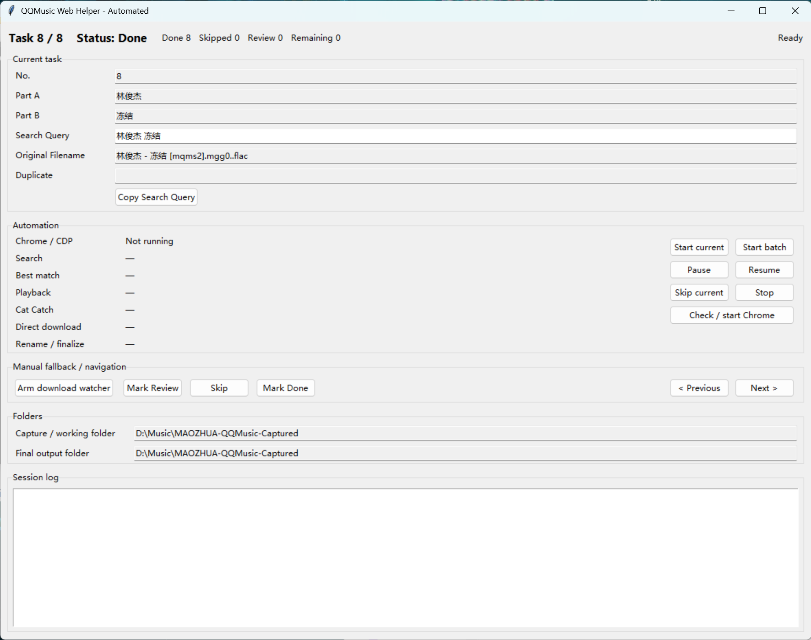

# QQMusic-Web-Helper-Automated

一个根据 CSV 任务表，自动在 QQ 音乐网页版中逐首搜索、匹配、播放并获取音频资源的 Windows 批量处理工具。

它适合已经有一张歌曲任务表、需要重复处理很多歌曲的场景。程序会读取每一条任务的 `Artist`、`Title` 和 `Search Query`，自动执行搜索与匹配，并配合猫抓（Cat Catch）扩展检测播放器产生的新音频资源，保存文件并更新任务状态。

## 能做什么

- 读取 `qqmusic_task_list.csv`。
- 从当前未完成任务继续，而不是每次都从第 1 条开始。
- 自动使用 `Search Query` 在 QQ 音乐网页中搜素。
- 对搜索结果进行匹配并选择最合适的结果。
- 如果第一次搜索结果不可用或匹配不足，会自动再搜索一次。
- 自动点击匹配结果的“播放”。
- 配合猫抓扩展检测当前播放产生的新音频资源。
- 自动保存检测到的音频资源。
- 完成后按歌曲信息整理文件名。
- 自动写回 CSV 任务的状态。
- 支持单首执行和连续批量执行。
- 批量模式中，单首处理失败会标记为 `Review`，记录错误后继续下一首。
- 支持暂停、恢复、跳过当前任务和停止。
- 提供手动下载监听作为备用操作。

## 环境需求

需要：

- Windows
- Python
- Windows 的 `py` Python Launcher
- Google Chrome
- Playwright for Python
- 猫抓（Cat Catch）Chrome 扩展
- 可正常使用的 QQ 音乐网页版

安装 Playwright：

```powershell
py -m pip install playwright
```

`start.bat` 会检查当前 `py` 对应的 Python 环境能否导入 Playwright；如果没有安装，会提示上面的安装命令。

本工具使用电脑上已经安装的 Google Chrome，并通过 Chrome 远程调试接口进行连接。

只需要安装 Python 的 `playwright` 包，不需要另外执行 `playwright install` 下载 Playwright 管理的 Chromium、Firefox 或 WebKit 浏览器。

## 文件结构

仓库中的主要文件：

```text
QQMusic-Web-Helper-Automated/
├── .gitignore
├── config.example.json
├── download-watcher.py
├── qq-automation.py
├── start.bat
├── task-controller.py
├── source/
|   ├── qqmusic_task_list.csv
|   └── images/
|       └── QQMusic-Web-Helper-Automated-ui.png
└── README.md
```

首次使用后，本地还会出现：

```text
QQMusic-Web-Helper-Automated/
├── config.json
├── logs/
│   └── session.log
└── __pycache__/
```

这些本地运行文件不会作为正常仓库内容提交。

- `start.bat`  
  日常启动入口。

- `config.example.json`  
  配置示例。首次使用时复制一份并改名为 `config.json`。

- `task-controller.py`  
  主界面和任务控制程序。

- `qq-automation.py`  
  QQ 音乐自动处理程序。

- `download-watcher.py`  
  下载完成后的文件监听、移动和重命名工具。

- `source/qqmusic_task_list.csv`  
  默认任务表。

- `logs/session.log`  
  运行日志，出现问题时可用于查看当前任务执行到了哪一步。

## 界面



## 第一次使用前的准备

### 1. 准备 `config.json`

仓库提供：

```text
config.example.json
```

复制一份并改名为：

```text
config.json
```

程序启动时读取的是 `config.json`，不是 `config.example.json`。

### 2. 修改本机路径

至少检查这些设置：

```json
{
  "task_file": "source/qqmusic_task_list.csv",
  "watch_folder": "D:/Music/QQMusic-Captured",
  "downloaded_folder": "D:/Music/QQMusic-Captured",
  "chrome_path": "C:/Program Files/Google/Chrome/Application/chrome.exe",
  "chrome_profile": "D:/QQMusic-Automation-Chrome"
}
```

含义：

- `task_file`  
  要读取的任务 CSV。

- `watch_folder`  
  自动化捕获到资源后首先写入 / 处理的目录。

- `downloaded_folder`  
  最终整理完成的文件保存目录。

- `chrome_path`  
  Google Chrome 的实际安装路径。

- `chrome_profile`  
  这个工具专用的 Chrome 用户数据目录。

`watch_folder` 和 `downloaded_folder` 可以设为同一个目录；这样文件会在同一目录中完成最终命名。

### 3. 准备专用 Chrome

工具会使用 `chrome_profile` 指定的独立 Chrome 数据目录，并通过 `Check / start Chrome` 自动启动带远程调试端口的 Chrome。

第一次使用建议：

1. 启动工具。
2. 点击：

   ```text
   Check / start Chrome
   ```

3. 等待专用 Chrome 打开。
4. 在这个专用 Chrome 中安装猫抓（Cat Catch）扩展。
5. 确认 `config.json` 中的：

   ```text
   cat_catch_extension_id
   ```

   与实际安装的扩展一致。
6. 在这个专用 Chrome 中打开 QQ 音乐并完成必要的登录 / 初次确认。

这个 Chrome Profile 与日常浏览使用的 Chrome Profile 是分开的，所以 QQ 音乐登录状态和扩展也需要在这里单独准备。

> QQ 音乐搜索结果中的歌曲被播放并自动跳转 QQ 音乐播放器页面后可能会有提示窗口。如果出现需要人工确认的首次提示，可以手动完成确认，也可以放任不管，当前资源捕获流程在弹窗存在的情况下也可以成功进行。

### 4. 准备任务表

默认任务文件：

```text
source/qqmusic_task_list.csv
```

可以使用同组的：

```text
QQMusic-Task-List-Builder
```

当前自动化搜索使用：

```text
Part A
Part B
Search Query
Status
```

其中搜索直接优先使用 `Search Query`。

`Resolved Artist` / `Resolved Title` 即使仍存在于旧 CSV 格式中，也不作为当前自动化的输入来源。

## 日常使用方法

### 1. 启动

双击：

```text
start.bat
```

打开主界面。

### 2. 确认 Chrome 状态

界面中的：

```text
Chrome / CDP
```

会显示当前专用 Chrome 是否已经可连接。

如果没有启动，点击：

```text
Check / start Chrome
```

也可以直接点击自动化开始按钮；正式运行前程序本身也会检查并尝试启动专用 Chrome。

### 3. 查看当前任务

`Current task` 区域会显示：

```text
No.
Part A
Part B
Search Query
Original Filename
Duplicate
```

界面顶部同时显示：

```text
Task 当前序号 / 总数
Done
Skipped
Review
Remaining
```

`Copy Search Query` 可以把当前任务的搜索词复制到剪贴板，方便人工检查。

### 4. 先测试当前一首

首次配置完成后，建议先点击：

```text
Start current
```

它只处理当前这一条任务。

程序会依次显示：

```text
Chrome / CDP
Search
Best match
Playback
Cat Catch
Direct download
Rename / finalize
```

每一步的当前状态。

如果当前歌曲成功：

- 资源会被保存；
- 文件会完成最终命名；
- 当前任务写成 `Done`；
- 单首模式结束。

如果当前歌曲失败：

- 当前任务写成 `Review`；
- 错误记录到日志；
- 单首模式停在这里，方便人工检查。

### 5. 批量执行

确认单首流程正常后，可以点击：

```text
Start batch
```

程序会从当前任务开始继续处理后面的任务。

已经是：

```text
Done
Skipped
```

的任务会被跳过。

批量模式中，如果某一首出现错误：

```text
当前任务 → Review
日志记录错误
继续下一首
```

不会因为普通的单首失败而结束整个批次。

如果失败的正好已经是最后一条任务，则因为没有下一条可继续，批次自然结束。

### 6. 批量运行中的按钮

#### `Pause`

暂停当前自动化。

#### `Resume`

继续已经暂停的自动化。

#### `Skip current`

在自动化正在运行时跳过当前任务。

当前任务会标记为：

```text
Skipped
```

批量模式下随后继续下一条。

#### `Stop`

停止整个自动化运行。

## 自动下载完成后的文件名

正常自动化成功后，最终文件名使用匹配到的 QQ 音乐结果：

```text
Title - Artist.m4a
```

文件名中的 Windows 非法字符会被替换。

如果目标目录中已经存在同名文件，不会直接覆盖，而会生成：

```text
Title - Artist (2).m4a
Title - Artist (3).m4a
...
```

## 任务状态

### `Pending`

尚未完成的普通任务状态。

### `Done`

已经完成。

### `Review`

自动化没有可靠完成，需要之后人工检查。

### `Skipped`

用户主动跳过。

运行过程中还可能短暂出现：

```text
Searching
Finalizing
WaitingDownload
```

这些是处理中的临时状态。

## 手动备用操作

界面中的：

```text
Manual fallback / navigation
```

提供自动化之外的人工操作。

### `Arm download watcher`

用于人工处理某一首时启动下载目录监听。

使用方式：

1. 停留在需要处理的任务。
2. 点击：

   ```text
   Arm download watcher
   ```

3. 手动完成资源下载。
4. 程序检测到工作目录中新出现并写入完成的文件后，会按当前任务的：

   ```text
   Title - Artist
   ```

   规则移动 / 重命名文件。

默认配置下，成功后任务会标记为 `Done` 并自动前进到下一条。

### `Mark Review`

手动把当前任务标记为：

```text
Review
```

### `Skip`

手动标记为：

```text
Skipped
```

并前进到下一条。

### `Mark Done`

手动标记为：

```text
Done
```

并前进到下一条。

### `< Previous` / `Next >`

在没有运行自动化时手动查看前一条或后一条任务。

## 启动时的状态检查

程序启动时会检查最终输出目录。

如果某个尚未标记完成的任务，已经存在符合：

```text
Title - Artist.m4a
```

形式的最终文件，程序会把这条任务修正为 `Done`，避免因为 CSV 状态落后而重复处理。

`Skipped` 不会被这种启动检查自动改成 `Done`。

## 日志

默认日志目录：

```text
logs/
```

主要日志：

```text
logs/session.log
```

界面底部也会实时显示当前 Session 的日志。

出现搜索、匹配、播放、猫抓资源或下载问题时，优先查看这里。

## 与另外两个工具配合

完整流程通常是：

```text
已有的非常规格式歌曲文件
    ↓
QQMusic-Task-List-Builder
    ↓
qqmusic_task_list.csv
    ↓
QQMusic-Web-Helper-Automated
    ↓
下载 / 捕获到的音频
    ↓
Format-Tools
    ↓
MP3
```
